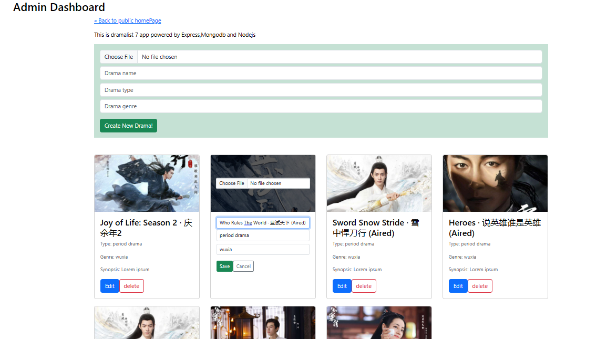

# DramaList App
> Discover the best and latest dramas/ series, comment ,like and share your thoughts about the drama.

### User features
 - Can see :
   > drama details ( name,type, genre, casts ,directors, synopsis, ratings)
   > Comment, like, share  and rate.

[Live Page]('')

# Built with

- Reactjs
- Nodejs
- ExpressJs
- CSS & HTML5
- JavaScript
- Mongodb
- webpack
- docker

## Live Demo (available)

## Available Scripts

In the project directory, you can run:

### `npm run dev`

## Authors

👤 **Author1**

- GitHub: [@kinginthenorthcodez](https://github.com/kinginthenorthcodez)

## 🤝 Contributing

Contributions, issues, and feature requests are welcome!

Feel free to check the [issues page](https://github.com/kinginthenorthcodez/dramalist-app/issues).

## Show your support

Give a ⭐️ if you like this project!

## Acknowledgments

- google & stackoverflow
- open source community

## 📝 License

This project is [MIT](./MIT.md) licensed.
